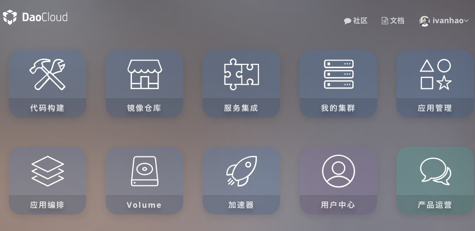
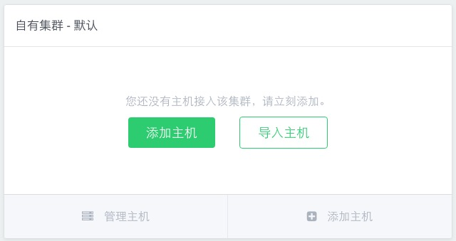
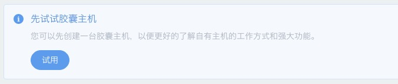

<!--
author:ivan 
date: 2016-02-16
title: 免费docker主机，daocloud.io 
tags: docker,daocloud
category: docker
status: publish
summary: docker越来越火了，国内不方便直接使用docker.io，但是有daocloud.io提供了很多docker镜像以及免费主机。
-->
***

##一、注册daocloud.io
daocloud.io很人性化的地方在于直接可以用github帐户登陆和注册，具体就不细说了。

##二、控制面板
进入daocloud.io后进入控制面板：

##三、免费docker主机
1. 创建主机


2. 选择胶囊主机


> 「胶囊主机」自带 Docker 运行环境，并自动接入 DaoCloud 容器管理平台。
> 每个「胶囊主机」可以免费体验 120 分钟，到期后会自动消失。发布到「胶囊主机」中的应用信息会保留并可以自动迁移。「胶囊主机」到期后可以再次体验。


* 使用视频*

<video id="video" controls="" preload="none" poster="./img/7.png">
 <source id="mp4" src="https://dn-daoweb-resource.qbox.me/nodes/add-cell.mp4" type="video/mp4">
 <p>Your user agent does not support the HTML5 Video element.</p>
</video>

```
```
